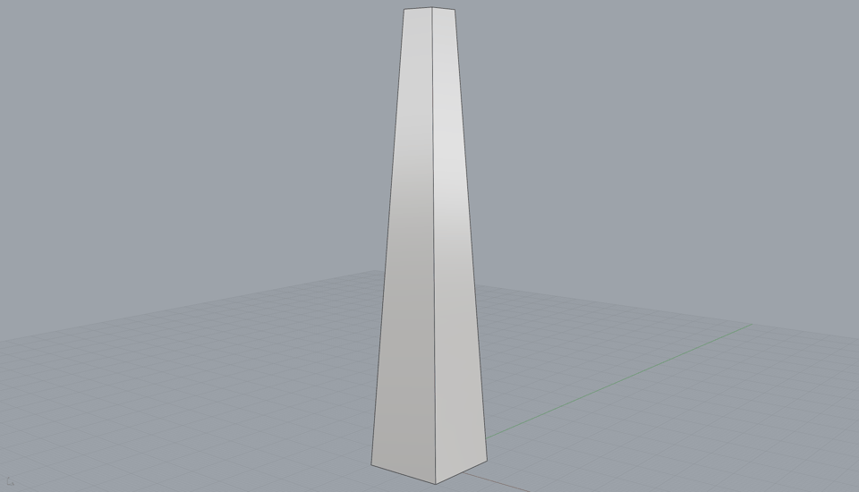

<p align="center">
  
  
</p>

<h1 align="center">Pantograph</h1>

<p align="center"><strong>Intelligence Aided Design</strong> — an agentic CAD workspace that writes editable definitions, not objects.</p>

<p align="center">
  <a href="https://www.pantograph.ai">pantograph.ai</a> ·
  <a href="ARCHITECTURE.md">architecture</a> ·
  <a href="#quick-start">quick start</a> ·
  <a href="LICENSE">Apache-2.0</a>
</p>

---

Most systems that turn language into 3D return a finished thing: a mesh, a render, a closed artifact. Pantograph returns the structure that produces things — a **definition graph** of typed nodes, tunable parameters, and wires, performed into native Rhino geometry and left open for you to re-author. The agent and the designer edit the same graph with the same operations.

<p align="center">
  
  <br />
  <sub>One parameter swept 0→6° — every frame is a real re-execution in Rhino 8.</sub>
</p>

## What it does

- **Language → definition.** Describe intent in plain language; the agent plans it and authors a graph through narrow, validated mutations (`add node`, `connect`, `set param`) — never baked geometry.
- **A canvas you own.** Drag nodes, wire ports, pull sliders, delete edges, resize, group-select. Every edit recompiles and re-performs in the live Rhino document.
- **Verify, then hand back.** The agent executes its definition, looks at a viewport capture of the result, repairs, and returns the graph to you. Every change — agent or designer — lands in a shared change log with provenance: which prompt clause each node answers, and why it exists.
- **Local by design.** Rhino, the agent, and your files stay on your machine. The bridge is loopback TCP; nothing is uploaded.

## Quick start

Requirements: Node 20+, pnpm, Python 3, Rhino 8, and the [claude](https://claude.com/claude-code) CLI (logged in — the agent runs on your Claude subscription; no API keys are stored in this repo).

```bash
git clone https://github.com/madebyrayz/pantograph.git
cd pantograph
pnpm install
pnpm dev
```

Then connect Rhino: open Rhino 8, type `ScriptEditor`, run `rhino_side/pantograph_listener.py`, and leave Rhino open. Open [localhost:3000/demo](http://localhost:3000/demo) and describe something to model.

**No Rhino?** The workspace still runs — the definition graph stays authorable, editable, and validatable; geometry waits until Rhino connects. To develop against a fake listener: `PANTOGRAPH_MOCK_PORT=9877 python3 mock_rhino.py`.

## How it works

```
conversation ──► agent (claude CLI) ──MCP──► narrow graph tools
                                                │  add node · connect · set param
canvas (React Flow) ◄──── definition graph ─────┘  the first-class object
                                                │  compile → rhinoscriptsyntax
                                                ▼
                                    Rhino 8 (live document, loopback TCP)
```

| Path | Role |
|---|---|
| `lib/graph/` | The definition graph: schema, op catalog, validation, mutations, compiler, versioned store |
| `app/api/graph/` | Graph read / mutate / execute endpoints, shared by agent and canvas |
| `app/api/chat/` | Runs the agent per message and streams its loop to the browser |
| `mcp_server.py` | MCP server exposing the graph tools to the agent |
| `rhino_side/pantograph_listener.py` | The listener that runs inside Rhino |
| `components/workspace/` | The canvas: edit a parameter, geometry re-forms |
| `eval/` | Internal structural checks (not a benchmark) |
| `cms/` | The research paper, rendered at pantograph.ai |

[ARCHITECTURE.md](ARCHITECTURE.md) maps each research claim to the code that implements it.

## Scope and honesty

Demonstrated: language to editable definition; the graph as the system's central, inspectable object; edits that propagate to live geometry; per-node provenance. Not demonstrated: benchmark results, production reliability, Grasshopper `.gh` emission (the graph compiles to rhinoscriptsyntax), and topological re-authoring of existing definitions — both named as future work, not claimed.

## Research

The accompanying paper, *The Editable Return*, argues the design position through cybernetics, notation theory, media theory, and the documented brittleness of parametric models in practice. Read it at [pantograph.ai](https://www.pantograph.ai).

## License

[Apache-2.0](LICENSE). Cite via [CITATION.cff](CITATION.cff).
Bugs and ideas: [info@pantograph.ai](mailto:info@pantograph.ai).
